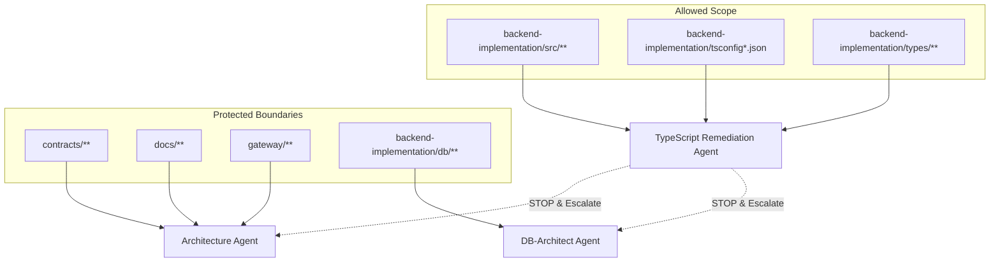

# Design Document

## Overview

The TypeScript Zero-Error Remediation system implements a phased, constraint-driven approach to eliminate TypeScript errors from the backend Node.js/Express codebase. The design prioritizes keystone fixes that resolve large error classes while maintaining strict boundaries around contracts, database schemas, and external APIs.

## Architecture

### Core Design Principles

1. **Contracts-First**: Preserve all external API shapes and OpenAPI contracts
2. **Incremental Remediation**: Phase-based approach targeting high-impact fixes first
3. **Quality Gates**: Mandatory validation at each step through hooks and testing
4. **Auditable Changes**: Small, focused commits with clear rationale
5. **Risk Minimization**: Strict scope boundaries and escalation protocols

### System Boundaries



## Components and Interfaces

### Phase Execution Engine

**Purpose**: Orchestrates the four-phase remediation process with validation gates

**Key Components**:
- Phase Controller: Manages phase transitions and validation
- Error Quantifier: Tracks error counts using `typecheck:count` and `typecheck:top`
- Validation Gate: Runs hooks and tests before allowing phase progression
- Escalation Handler: Manages boundary violations and agent handoffs

**Interface**:
```typescript
interface PhaseExecutionEngine {
  executePhase(phase: RemediationPhase): Promise<PhaseResult>
  validatePhaseCompletion(phase: RemediationPhase): Promise<ValidationResult>
  quantifyErrors(): Promise<ErrorMetrics>
  escalateIfNeeded(violation: BoundaryViolation): void
}

interface PhaseResult {
  phase: RemediationPhase
  errorsFixed: number
  filesModified: string[]
  commitHash?: string
  nextPhase?: RemediationPhase
}
```

### Keystone Fix Resolver (Phase 1)

**Purpose**: Addresses foundational TypeScript configuration and typing issues

**Components**:
- TSConfig Hygienist: Validates and fixes TypeScript configuration
- Express Type Augmentor: Creates global Express type definitions
- Logger Normalizer: Unifies logger imports and resolves duplicate exports

**Key Fixes**:
1. **TSConfig Hygiene**: Ensure `baseUrl: "src"` and `"@/*": ["*"]` path mapping
2. **Express Typing**: Create `src/types/express.d.ts` for `req.user` augmentation
3. **Logger Normalization**: Resolve duplicate Timer exports in `utils/logger.ts`

### Shared Type Harmonizer (Phase 2)

**Purpose**: Fixes central type definitions to eliminate cascading errors

**Components**:
- API Response Unifier: Standardizes `ApiResponse<T>` and `PaginatedData<T>`
- Result Type Fixer: Resolves `Result<T,E>` invariant violations
- Response Formatter Aligner: Ensures consistency between types and formatters

**Type Definitions**:
```typescript
// Standardized API Response Types
interface ApiResponse<T> {
  data: T
  meta?: ResponseMeta
  success: boolean
}

interface PaginatedData<T> {
  items: T[]
  pagination: PaginationMeta
}

// Fixed Result Type Invariants
type Result<T, E> = Success<T> | Failure<E>
// Ensures E never widens to E | undefined
```

### Vector/Weaviate Cluster Resolver (Phase 3)

**Purpose**: Addresses complex type issues in AI/ML service integrations

**Components**:
- Weaviate Client Adapter: Wraps client types for configuration compatibility
- Optional Guard Enforcer: Replaces unsafe optional chaining with proper narrowing
- Batch Status Normalizer: Standardizes `string | null` vs `string | undefined`

**Adapter Pattern**:
```typescript
// Thin adapter for Weaviate client type compatibility
interface WeaviateClientAdapter {
  client: WeaviateClient
  adaptApiKey(config: string): WeaviateApiKey
  safeQuery<T>(query: QueryParams): Promise<T | undefined>
}
```

### Dead Code Eliminator (Phase 4)

**Purpose**: Removes unused modules and resolves remaining inconsistencies

**Components**:
- Dead Module Detector: Identifies unused legacy modules
- Import Path Normalizer: Standardizes `@/` vs relative import usage
- TS-Ignore Auditor: Limits and documents TypeScript suppressions

## Data Models

### Error Tracking Model

```typescript
interface ErrorMetrics {
  totalErrors: number
  errorsByFile: Map<string, number>
  errorsByType: Map<string, number>
  topErrorFiles: Array<{file: string, count: number}>
  timestamp: Date
}

interface PhaseProgress {
  phase: RemediationPhase
  startErrors: number
  currentErrors: number
  errorsFixed: number
  filesModified: string[]
  validationsPassed: boolean
}
```

### Validation Model

```typescript
interface ValidationResult {
  passed: boolean
  typeCheckPassed: boolean
  depCruisePassed: boolean
  buildPassed: boolean
  testsPassed: boolean
  hooksPassed: boolean
  errors: string[]
}

interface CommitMetadata {
  phase: RemediationPhase
  errorsBefore: number
  errorsAfter: number
  filesChanged: string[]
  rationale: string
  followUpActions?: string[]
}
```

## Error Handling

### Boundary Violation Handling

**Contract Violations**: If changes would affect `contracts/**` or public API shapes:
1. Immediately halt execution
2. Document the required change
3. Escalate to Architecture Agent
4. Provide context for contract modification needs

**Database Schema Violations**: If changes would affect database structure:
1. Stop all modifications
2. Document schema impact
3. Escalate to DB-Architect Agent
4. Preserve existing migration integrity

**Security Violations**: If changes would expose secrets or affect tenant isolation:
1. Reject the change immediately
2. Log security concern
3. Provide alternative approach
4. Maintain security boundaries

### Hook Failure Recovery

```typescript
interface HookFailureHandler {
  analyzeFailure(hookOutput: string): FailureAnalysis
  suggestFix(failure: FailureAnalysis): FixSuggestion
  rollbackIfNeeded(commitHash: string): Promise<void>
}

interface FailureAnalysis {
  failureType: 'lint' | 'test' | 'build' | 'security'
  affectedFiles: string[]
  errorMessages: string[]
  suggestedActions: string[]
}
```

## Testing Strategy

### Validation Pipeline

1. **Pre-Commit Validation**:
   - Run `./scripts/repo-audit.sh` for every modified file
   - Ensure all hooks pass before proposing commits
   - Validate TypeScript compilation

2. **Phase Completion Testing**:
   - Execute `npm run type-check` for zero errors
   - Run `npm run depcruise` for dependency validation
   - Perform `npm run build:production` for build integrity
   - Execute `npm run test:smoke` for regression testing

3. **Continuous Monitoring**:
   - Track error count reduction after each phase
   - Monitor build performance impact
   - Validate contract stability through automated checks

### Test Coverage Requirements

- **Unit Tests**: Maintain existing test coverage during remediation
- **Integration Tests**: Ensure API behavior remains unchanged
- **Contract Tests**: Validate OpenAPI compliance throughout process
- **Performance Tests**: Monitor build time and runtime performance impact

## Implementation Phases

### Phase 1: Foundations (Keystone Fixes)
- **Goal**: Remove systemic errors with minimal risk
- **Success Criteria**: Substantial error count reduction, build stability maintained
- **Key Activities**: TSConfig hygiene, Express typing, logger normalization

### Phase 2: Shared Response & Result Types
- **Goal**: Fix central types to eliminate downstream errors
- **Success Criteria**: Response/result-related errors reach zero
- **Key Activities**: ApiResponse standardization, Result type invariant fixes

### Phase 3: Vector & Weaviate Clusters
- **Goal**: Resolve complex AI/ML service type issues
- **Success Criteria**: Vector/Weaviate files compile cleanly
- **Key Activities**: Client type adaptation, optional guard enforcement

### Phase 4: Stragglers & Dead Code
- **Goal**: Eliminate remaining errors and cleanup
- **Success Criteria**: Zero TypeScript errors, clean codebase
- **Key Activities**: Dead code removal, import path normalization

## Performance Considerations

### Build Performance
- Monitor TypeScript compilation time impact
- Ensure incremental compilation benefits are preserved
- Validate that type checking performance doesn't degrade

### Runtime Performance
- Confirm that type fixes don't introduce runtime overhead
- Maintain existing performance characteristics
- Preserve optimized code paths

### Development Experience
- Improve IDE type checking responsiveness
- Enhance autocomplete and IntelliSense accuracy
- Reduce developer friction from type errors